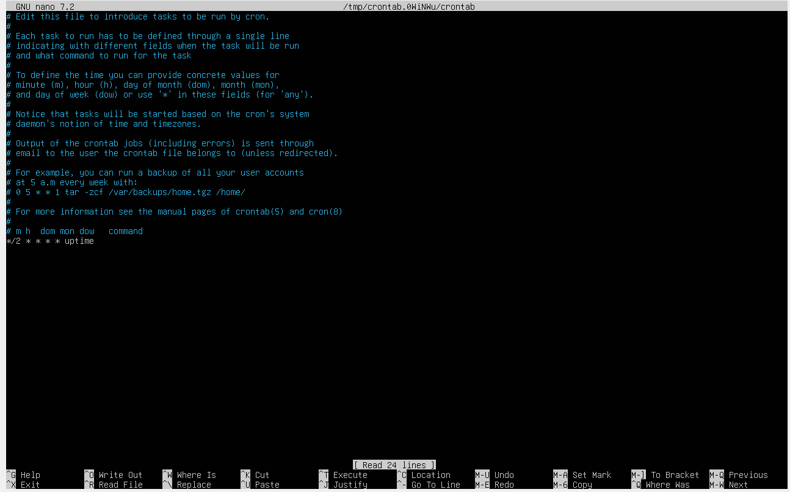

# Операционные системы UNIX/Linux (Базовый)
Установка и обновления системы Linux. Основы администрирования.

## 1) Установка ОС
1. Устанавили VirtualBox и создали новую виртуальною машину с операционной системой **Ubuntu 20.04 Server LTS**.
###### Рисунок 1 - Созданная в VBox виртуальная машина

2. На ВМ отсутствует графический интерфейс.
###### Рисунок 2 - Терминал виртуальной машины

3. Ввели команду ``cat /etc/issue``, чтобы проверить текущую версию ОС.
###### Рисунок 3 - Вывод команды ``cat /etc/issue``

4. На скриншоте видно, что сейчас установлена ОС версии 20.04.6 LTS.

## 2) Создание пользователя
1. Командой ``useradd alex`` создали нового пользователя ``alex``.
###### Рисунок 4 - Выполнение команды ``useradd alex``

2. Комнадой ``usermod -aG adm alex`` добавили пользователя ``alex`` в группу ``adm``.
  - Флаг -a - добавление пользователя в группу
  - Флаг -G - указание группы, куда добавлять
###### Рисунок 5 - Добавление пользователя в группу

3. Командой ``cat /etc/passwd | grep "alex"`` проверили появилась ли инфорамция о новой учетной записи.
###### Рисунок 6 - Поиск информации о новой учетной записи в файле ``/etc/passwd``

4. Новый пользователь создан

## 3) Настройка сети ОС
1. Изменили название машины на ``user-1`` утилитой ``hostamectl``.
###### Рисунок 7 - Изменение имени хоста на ``user-1``

2. Используя утилиту ``timedatectl`` устанавили Московское время.
###### Рисунок 8 - Устанавка временной зоны ``Europe/Moscow``

3. Проверили, что в системе установлено верное время.
###### Рисунок 9 - Вывод текущего времени командой ``date``

4. Вывели список всех сетевых интерфейсов командой ``ip a``.
###### Рисунок 10 - Список сетевых интерфейсов

5. Первым в списке отображается Loopback-интерфейс. Это сетевой интерфейс, который позволяет операционной системе устанавливать связи между процессами на одном ПК.
6. В системных логах посмотрели ip-адрес, который ВМ получает от DHCP-сервера Vbox. В нашем случае это 10.0.2.15.
###### Рисунок 11 - Записи syslog о dhcp

7. DHCP(Dynamic Host Configuration Protocol) - сетевой протокол, позволяющий автоматически назначать устройствам в сети конфигурацию(в том числе и ip-адреса).
###### Рисунок 12 - Просмотр внешнего ip-адреса

###### Рисунок 13 - Просмотр шлюза по умолчанию

8. Чтобы задать статические настройки, изменили сетевой адаптер ВМ с NAT на bridged. Bridged-адаптер дает ВМ возможность получать ip-адрес из локальной сети.
9. Затем с помощью утилиты ``netplan`` поменяли сетевые настройки
* Шлюз по умолчанию - внутренний адрес роутера: 192.168.0.1
* Адрес машины - статический адрес из локальной сети роутера: 192.168.0.3
* DNS сервера общедоступные: 8.8.8.8, 1.1.1.1
###### Рисунок 14 - Конфигурация netplan

10. Отправили ``ping`` до адреса 1.1.1.1 и ya.ru
###### Рисунок 15 - ping 1.1.1.1

###### Рисунок 16 - ping ya.ru

11. Пинги проходят.

## 4) Обновление ОС
1. Ввели команду для обновления пакетов
###### Рисунок 17 - Команда для обновления пакетов

2. Ввели команду еще раз и проверили, что новых версий пакетов больше нет.
###### Рисунок 18 - Команда после обновления

## 5) Использование команды sudo
1. sudo - утилита, которая временно повышает привелегии пользователя до root для выполнения команды.
2. Выдача пользователю прав использования ``sudo`` осуществляется добавлением пользователя в файл ``sudoers``.
###### Рисунок 19 - Открытие файла etc/sudoers.tpm

###### Рисунок 20 - Добавление alex в sudoers

3. Теперь пользователь ``alex`` может выполнять команды от root.
###### Рисунок 21 - Переход в командную оболочку пользователя ``alex``

###### Рисунок 22 - Изменение hostname

###### Рисунок 23 - Новое имя хоста

## 6) Установка и настройка службы времени
###### Рисунок 24 - Время настоящего часового пояса

###### Рисунок 25 - Вывод команды ``timedtectl show``

* Вывод содержит ``NTPSynchronized=yes``

## 7) Установка и использование текстовых редакторов
###### Рисунок 26 - JOE установлен

###### Рисунок 27 - vim установлен

###### Рисунок 28 - nano устанволен

### Выйти с сохранением изменений
###### Рисунок 29 - файл test_vim.txt

* **Выход из файла с сохранением: :wq**
###### Рисунок 30 - файл test_nano.txt

* **Выход из файла с сохранением: Ctrl+X -> y -> Enter**
###### Рисунок 31 - файл test_joe.txt

* **Выход из файла с сохранением: Ctrl+K X -> Ctrl+K D -> y**

### Выйти без сохранения изменений
###### Рисунок 32 - файл test_vim.txt

* **Выход из файла без сохранения: :q!**
###### Рисунок 33 - файл test_nano.txt

* **Выход из файла без сохранения: Ctrl+X -> n**
###### Рисунок 34 - файл test_joe.txt

* **Выход из файла без сохранения: Ctrl+C -> y**

### Поиск слова и редактирование 
1. Поиск слова в vim: /<слово>
###### Рисунок 35 - Поиск слова School в test_vim.txt

2. Замена слова в vim: :s/<слово>/<замена>
###### Рисунок 36 - Замена School на sarirunc в test_vim.txt

3. Поиск слова в nano: (Ctrl + W)
###### Рисунок 37 - Поиск слова School в test_nano.txt

4. Замена слова в nano: (Ctrl + W) -> (Ctrl + R)
###### Рисунок 38 - Замена School на sarirunc в test_nano.txt

5. Поиск и замена слова в joe Ctrl+K F
###### Рисунок 39 - Поиск слова School в test_joe.txt

###### Рисунок 40 - Замена School на sarirunc в test_joe.txt

## 8) Установка и базовая настройка сервиса SSHD
1. Установили ssh-server.
###### Рисунок 41 - Установка ssh

2. дОбавили его в автостарт.
###### Рисунок 42 - Добавление ssh в автостарт

3. Изменили порт на 2022 в файле конфигурации ssh.
###### Рисунок 43 - Редактирование файла конфигурации sshd_config

4. Перезагрузили сервис, проверили, что порт изменился.
###### Рисунок 44 - Видно, что порт изменился

5. Нашли sshd в запущенных процессах.
###### Рисунок 45 - Выполнение команды ``ps -aux | grep "ssh"``

* ps - выводит процессы
* -a - показывает процессы для всех пользователей
* -u - отобращает пользователя/владельца процесса
* -x - также показывает процессы, не привязанные к терминалу
6. Выполнили команду ``netstat``
###### Рисунок 46 - Вывод команды ``netstat -tan``

* Команда ``netstat`` отображает информацию о сетевой конфигурации и активности системы Linux, включая сетевые соединения, таблицы маршрутизации, статистику интерфейса и членство в многоадресной рассылке.
* -t - Отображает TCP-соединения
* -a - Показывает все прослушивающие порты и активные соединения
* -n - Показывает числовые адреса вместо разрешения хостов и портов
* Столбцы:
  - Протокол
  - Количество принятых пакетов в очереди
  - Количество отправленных пакетов в очереди
  - Локальный адрес, 0.0.0.0 означает что подключаться можно к любому адресу, но только по 2022 порту
  - Удаленный адресс, 0.0.0.0:* означает, что принимать подключения можно с любого адреса, с любого порта
  - Статус порта

## 9) Установка и использование утилит top, htop
1. Запустили утилиту ``top``.
###### Рисунок 47 - Запуск утилиты ``top``

Утилита показывает следующую информацию:
- uptime: 12 min
- количество авторизованных пользователей: 1
- среднюя загрузка системы: 0.91, 0.54, 0.21 
- общее количество процессов: 97
- загрузку cpu:
  •  us (user): 0.0% - время, затраченное процессами пользователя.
  •  sy (system): 0.0% - время, затраченное ядром.
  •  ni (nice): 0.0% - время, затраченное процессами с измененным приоритетом.
  •  id (idle): 100.0% - время простоя CPU.
  •  wa (wait): 0.0% - время ожидания ввода/вывода.
  •  hi (hardware interrupts): 0.0% - время обработки аппаратных прерываний.
  •  si (software interrupts): 0.0% - время обработки программных прерываний.
  •  st (steal time): 0.0% - время, украденное у виртуальной машины другим гипервизором.
- загрузку памяти:
  •  total: 2906.2 MiB - общий объем памяти.
  •  free: 2404.8 MiB - объем свободной памяти.
  •  used: 361.4 MiB - объем используемой памяти.
  •  buff/cache: 296.9 MiB - объем памяти, используемой для буферов и кэша.
- pid процесса занимающего больше всего памяти: 1 (PID=1, занимает 0.4% памяти)
- pid процесса, занимающего больше всего процессорного времени: 8 (PID=8, занимает 0.3% CPU)

2. Зарустили утилиту ``htop``
###### Рисунок 48 - Сортировка ``htop`` по PID

###### Рисунок 49 - Сортировка ``htop`` по PERCENT_CPU

###### Рисунок 50 - Сортировка  ``htop``по PERCENT_MEM

###### Рисунок 51 - Сортировка ``htop`` по TIME

###### Рисунок 52 - ``htop`` отфильтрованный по sshd

###### Рисунок 53 - ``htop`` с процессом syslog, найденным, используя поиск

###### Рисунок 54 - ``htop`` с добавленным выводом hostname, clock и uptime

## 10) Использование утилиты fdisk
###### Рисунок 55 - Запуск комнады ``fdisk -l``

* Жесткий диск называется /dev/sda
* Его размер составляет 50 GiB\
* Он содержит 104857600 секторов
* Размер swap составляет 24 GiB

## 11) Использование утилиты df
###### Рисунок 56 - Запуск комнады ``df``

* Для корневого раздела:
  - Размер корневого раздела составляет 24590672 1K-block
  - Размер занятого пространства — 6757684 1K-blocks
  - Размер свободного пространства — 16558520 1K-blocks
  - Процент использования — 29%.
* Единицей измерения в выводе является 1K-blocks (1 килобайт).
###### Рисунок 57 - Запуск комнады ``df -Th``

* Для корневого раздела (/):
  - Размер раздела: 24Гб
  - Размер занятого пространства: 6,5 Гб
  - Размер свободного пространства: 16 Гб
  - Процент использования: 29%
* Тип файловой системы для раздела: ext4

## 12) Использование утилиты du
###### Рисунок 58 - Размер папки /home (в байтах, в человекочитаемом виде)

###### Рисунок 59 - Размер папки /var (в байтах, в человекочитаемом виде)

###### Рисунок 60 - Размер папки /var/log (в байтах, в человекочитаемом виде)

###### Рисунок 61 - Размер каждого элемента вложенного в /var/log

## 13) Установка и использование утилиты ncdu
###### Рисунок 62 - Размер папки /home

###### Рисунок 63 - Размер папки /var

###### Рисунок 64 - Размер папки /var/log

## 14) Работа с системными журналами
1. Нашли последнее время авторизации пользователя.
###### Рисунок 65 - Записи об авторизации из auth.log

  * Время последней успешной авторизации: 2025-03-16T18:04:24
  * Имя пользователя: sarirunc
  * Метод входа в систему: с помощью логина
2. Перезапустили SSHd
###### Рисунок 66 - Сообщения о перезапуске службы

## 15) Использование планировщика заданий CRON
1. Добавили новую зачу в планировщик.
###### Рисунок 67 - Добавление новой задачи в файл ``crontab``

2. Проверили выполнение этой задачи.
###### Рисунок 68-69 - Две записи в журнале о выполнении команды ``uptime``

3. Вывели список задач.
###### Рисунок 70 - Cписок текущих заданий для CRON

4. Удалили задачи.
###### Рисунок 71 - Удаление задач

5. Еще раз проверили список
###### Рисунок 72 - Теперь в списке нет задач

